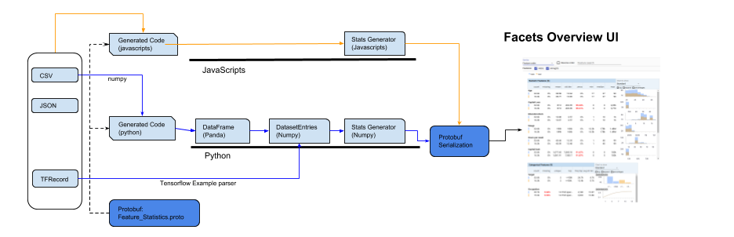
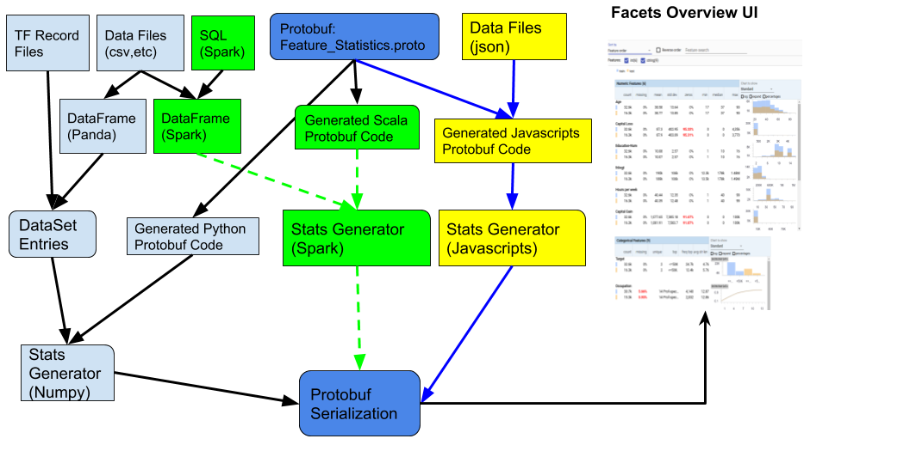

# Facets Overview Spark


## What is "Facets Overview Spark"

Facets Overview Spark is an implementation of Google Facet Overview (https://github.com/PAIR-code/facets) using Spark and Scala.

The project is open sourced by GoPro Data Science Engineering team.


## Introduction

Google Open Sourced the Facets Project in 2017 (https://github.com/PAIR-code/facets), which can help Data Scientists to better understand the data set 
and under the slogan that "Better data leads to better models".

The Google "Facets" includes two sub-projects: Facets-overview and Facets-dive.
 
"Facets Overview "takes input feature data from any number of datasets, analyzes them feature by feature and visualizes the analysis.

Based on Facets( github page: https://github.com/PAIR-code/facets)

```
Overview gives a high-level view of one or more data sets. It produces a visual feature-by-feature statistical analysis, and can also be used to compare statistics across two or more data sets. The tool can process both numeric and string features, including multiple instances of a number or string per feature.
Overview can help uncover issues with datasets, including the following:

* Unexpected feature values
* Missing feature values for a large number of examples
* Training/serving skew
* Training/test/validation set skew
Key aspects of the visualization are outlier detection and distribution comparison across multiple datasets. Interesting values (such as a high proportion of missing data, or very different distributions of a feature across multiple datasets) are highlighted in red. Features can be sorted by values of interest such as the number of missing values or the skew between the different datasets.

```
Currently Google is no longer active develop Facets Project, but the Facets-overview has been integrated into TFX Validation (https://www.tensorflow.org/tfx/data_validation/get_started, https://github.com/tensorflow/tfx/blob/master/docs/guide/statsgen.md)
and What-If-Tools (https://pair-code.github.io/what-if-tool/). In TFX, one can launch the facets-overview visualization like
```
    tfdv.visualize_statistics(stats)
```

With Facets-overview-spark, not only you can generate the statistics using spark for big data set, but also you can visualize
the statistics with Facets just like TFX validation, with simple HTML or jupyter notebook (with out depends on TFX) 
 
 
## Facets-overview Implementations

The Facets-overview is consists of 

* Feature Statistics Protocol Buffer
* Feature Statistics Generation
* Visualization


The implementation of Feature Statistics Generation have two flavors : Python (used by Jupyter notebook) and Javascripts (used by web )




Current implemention is in python depends on Numpy or Javascripts. Which means the data statics generation is limited by 
one machine or one browser. 

This project provides an additional implementation for Statistics generation. 
We can use Spark to leverage the spark generate stats with distributed computinig capability




## Design Considerations
* We need to find a Scala Protobuf generator
* The python implementation is in loop-mutable and update fasion, we need re-arrange it to use immutable collection
* Numpy Implementation load all the data is in Array on the current computer, we need some way to transform data without load all data into memory.
* We also need to find equivalent Numpy functions such as avg, mean, stddev, histogram
* The "overview" implementation can be apply to Tensorflow Record (tf.sampels, tf.sequenceSamples), where the data value could be array or array of array of data. 
* In this implementation, we can leveraging tensorflow/ecosystem/spark-tensorflow-connector for tensorflow record support, where we can load the TFRecords into spark DataFrame. Once the DataFrame is created, rest of implementation is almost same.
* We use DataFrame to represent the Feature. this is equivalent the feature array used in the Numpy. 
* Efficiency is not the major concern in this first version of design, we may have to pass data in multiple passes.
* Feature names need to be santized (replace white space, dash (-) or special characters to underscore)

## Data Structures

Based on Feature_statistics Protobuf definitions, 

* Each dataset has DatasetFeatureStatistics which contains lists metadata (name of dataset, number of sample, and Seq[FeatureNameStatistics])
* Each FeatureNameStatistics is feature stats for the given dataset, which includes feature name and data type and one of (NumericStatistics,StringStatistics or binary_stats)
* NumericStatistics consists CommonStatistics (std_dev,mean, median,min, max, histogram)
* StringStatistics consists CommonStatistics  as well as (unique values, {value, frequency}, top_values,avg_length, rank_histogram )

Google's Python implementation mainly use dictionary to hold data structures. In this implemenation, we define several additional data structures to help organize the data. 

* Each dataset can be presented by the NamedDataFrame
* Each dataset can be split with different features, so that it can also be converted to DataEntrySet
* Each DataEntry represents one feature with basic information as well the DataFrame for the feature.
* Each Feature associate with FeatureNameStatistics defined above, we use BasicNumStats and BasicStringStats to capture the basic statistics

```
case class NamedDataFrame(name:String, data: DataFrame)
case class DataEntrySet(name: String, size: Long, entries : Array[DataEntry])
case class DataEntry(featureName: String,
                     `type` : ProtoDataType,
                     values:DataFrame,
                     counts: DataFrame,
                     missing : Long,
                     feat_lens: Option[DataFrame] = None
                    )
case class BasicNumStats(name: String,
                         numCount: Long = 0L,
                         numNan :Long = 0L,
                         numZeros:Long = 0L,
                         numPosinf:Long = 0,
                         numNeginf: Long = 0,
                         stddev : Double = 0.0,
                         mean   : Double = 0.0,
                         min    : Double = 0.0,
                         median : Double = 0.0,
                         max    : Double = 0.0,
                         histogram: (Array[Double], Array[Long])
                        )

case class BasicStringStats(name: String,
                            numCount: Long = 0,
                            numNan :Long = 0L
 )
 
 
```

Main  class

```
class FeatureStatsGenerator(datasetProto: DatasetFeatureStatisticsList) {

 def protoFromDataFrames(dataFrames: List[NamedDataFrame],
                         features : Set[String] = Set.empty[String],
                         histgmCatLevelsCount:Option[Int]=None): DatasetFeatureStatisticsList = ???
  

}


 
``` 
notice here that DatasetFeatureStatisticsList is class generated based on protobuf definition

## FeatureStatsGenerator


## Usage Samples

   ### Generate Protobuf from DataFrame (using CSV)

   In this example, load the CSV file (adult.data.csv, adult.test.csv) into Spark DataFrame
   then pass the DataFrame to FeatureStatsGeneator to generate the protobuf class.

   The file can then be persisted into a binary protobuf file, or based64 encoded binary protobuf file.

   Few utility functions for loading from CSV and persist to file are provided

   As you can see, once the DataFrame is created, the rest of the code is the same.

   The examples can easily used for DataFrames from JSON, SQL, Tensorflow Records etc.

   For instances, I can simply change the functions to

   ```
    val trainData: DataFrame = loadJSONFile("path/to/data/jsonfile")
    val testData : DataFrame  = loadJSONFile("path/to/test/jsonfile")

    val trainData: DataFrame = sqlContext.sql("select * from DataTable")
    val testData : DataFrame = sqlContext.sql("select * from TestTable")

   ```

   Here is the example:

   First load CSV files (data and test) into DataFrames

```
    val features = Array("Age", "Workclass", "fnlwgt", "Education", "Education-Num", "Marital Status",
                         "Occupation", "Relationship", "Race", "Sex", "Capital Gain", "Capital Loss",
                         "Hours per week", "Country", "Target")

    val trainData: DataFrame = loadCSVFile("src/test/resources/data/adult.data.csv")
    val testData : DataFrame = loadCSVFile("src/test/resources/data/adult.test.txt")
```
    Next Associate the column names ("schema") to the loaded DataFrame, then created a
    list of "Named DataFrame"

```
    val spark = sqlContext.sparkSession
    import spark.implicits._

    val train = trainData.toDF(features: _*)
    val test = testData.toDF(features: _*)

    val dataframes = List(NamedDataFrame(name = "train", train), 
                          NamedDataFrame(name = "test", test))

```
   Next, we create FeatureStatsGenerator, and passed the namedDataFrame list to the generator,
   then call ```protoFromDataFrames(dataframes)``` to generate the stats.

```
    val generator = new FeatureStatsGenerator(DatasetFeatureStatisticsList())
    val proto = generator.protoFromDataFrames(dataframes)
```
    Once we have the feature stats probuf, we can save it to file, which can be loaded into web
    or jupyter notebook.


```
    persistProto(proto,base64Encode = false, new File("src/test/resources/data/stats.pb"))
    persistProto(proto,base64Encode = true, new File("src/test/resources/data/stats.txt"))
```

   Here are some utility functions

```
  
  private def loadCSVFile(filePath: String) : DataFrame = {
    val spark = sqlContext.sparkSession
    spark.read
      .format("org.apache.spark.sql.execution.datasources.csv.CSVFileFormat")
      .option("header", "false") //reading the headers
      .option("mode", "DROPMALFORMED")
      .option("inferSchema", "true")
      .load(filePath)
  }

  
  private def persistProto(proto: DatasetFeatureStatisticsList, base64Encode: Boolean = false, file: File ) = {
    if (base64Encode) {
      import java.util.Base64
      val b = Base64.getEncoder.encode(proto.toByteArray)
      import java.nio.charset.Charset
      import java.nio.file.{Files, Paths}
      val  UTF8_CHARSET = Charset.forName("UTF-8")

      Files.write(Paths.get(file.getPath), new String(b, UTF8_CHARSET).getBytes())
    }
    else {
      Files.write(Paths.get(file.getPath), proto.toByteArray)
    }
  }

```

### Generating stats for SequenceExample data

    In this example, we generate feature stats for the DataFrame
    that is the same as TFRecord SequenceExample

    The protobuf is then print to Json for easy to read.
```
     val data = Seq((Seq(Seq("Tim Robbins","Morgan Freeman"), Seq("Brad Pitt","Edward Norton","Helena Bonham Carter")),
                        Seq(Seq("The Shawshank Redemption"),Seq("Fight Club")),
                        Seq(Seq(9.0), Seq(9.7)),
                        19L,
                        List("Majesty Rose", "Savannah Outen", "One Direction"),
                        "pt_BR"
                      ))
        val featureNames = Seq("Movie Actors" ,"Movie Names",  "Movie Ratings","Age" ,"Favorites",  "Locale")
        val dataDF = spark.createDataFrame(data).toDF(featureNames:_*)


        dataDF.printSchema()
        dataDF.show()
        //generate datastats
        val dataframes = List(NamedDataFrame(name = "data", dataDF))
        val p = generator.protoFromDataFrames(dataframes)

        println("json=" + toJson(p))


  private def toJson(proto: DatasetFeatureStatisticsList) : String = {
    import scalapb.json4s.JsonFormat
    JsonFormat.toJsonString(proto)
  }

```

### Generate Stats for TFRecords

```
 val spark = sqlContext.sparkSession

 val schema = StructType(List(StructField("id", IntegerType),
              StructField("IntegerTypeLabel", IntegerType),
              StructField("LongTypeLabel", LongType),
              StructField("FloatTypeLabel", FloatType),
              StructField("DoubleTypeLabel", DoubleType),
              StructField("VectorLabel", ArrayType(DoubleType, containsNull =  true)),
              StructField("name", StringType)))


 val df =  TFRecordHelper.loadTFRecords(spark, path,  TFRecordType.Example, Some(schema))

 val p  = generator.protoFromDataFrames(dataframes)

 println("json=" + toJson(p))

```

 The TFRecordHelper is small utility class which allow your to use leverage enumerated TFRecordType
 and pass-in optional schema


## How to use the generated feature statistics in Jupyter notebook (scala, python)

   This demo simulates the original facets-overview with
   (https://github.com/PAIR-code/facets/blob/master/facets_overview/Overview_demo.ipynb)
   in the original demo train data and test data are located at

   https://archive.ics.uci.edu/ml/machine-learning-databases/adult/adult.data
   https://archive.ics.uci.edu/ml/machine-learning-databases/adult/adult.test

   we decided to pre-download the data, the data is not large, so we store data in the project
   and we can work offline.

   the original demo has the following parts (in different cells, in Jupyter Notebook)
   * Part 1: Generate Panda DataFrames from CSV files
   * Part 2: Pass the data frames to the features stats generator to generate protobuf
   * Part 3: Base64 Encode the Protobuf structure to String
   * Part 4: Pass the probuf string to HTML Display

   We are going to do the same

   * Part 1: Use Spark to generate Spark DataFrames from CSV files (Scala)
   * Part 2: Pass the data frames to the features stats generator to generate protobuf (Scala + Spark), probuf is save to local file
   * Part 3  In Jupyter Notebook, we read the protobuf from file and encoded to base64 if needed.
   * Part 4: Pass the probuf structure to HTML Display


   Let's dive a bit more details on each part.

   * Part 1: Generate Spark Data Frames
   
```
    //original feature columns
    val columns = Array("Age", "Workclass", "fnlwgt", "Education", "Education-Num", "Marital Status",
      "Occupation", "Relationship", "Race", "Sex", "Capital Gain", "Capital Loss",
      "Hours per week", "Country", "Target")

    //normalize the feature names by removing dash, space etc.
    val features: Array[String] = DataFrameUtils.sanitizedNames(columns)
```
    Slightly different from the original examaple, we sanitized the column, Column contains "-" or white space ' ' 
    or special characters may not be works well if one decide to persist the data frame to hive table.
    
    The libary always santize the column name during stats generation as part of the design consideration
    so we need to santize the feature columns first.  
     
    Next, we use Spark CSV parser to load the csv to Data Frames,

```
    //load train data and test data from CSV Files
    val trainData: DataFrame = loadCSVFile("src/test/resources/data/adult.data.csv")
    val testData: DataFrame = loadCSVFile("src/test/resources/data/adult.test.txt")

    //set the feature column names to the Data Frames.
    val train = trainData.toDF(features: _*)
    val test = testData.toDF(features: _*)    
```
    Once we load the data frames, we can put them into NamedDataFrames, then we are ready for next steps. 
    
```
    //create named dataframes
    val dataframes = List(NamedDataFrame(name = "train", train), NamedDataFrame(name = "test", test))
    
```

   * part 2: generate feature statistics and save to files
   
    Here are saved two version of files, one is binary, andother one is base64 encoded binary file.
    If one uses the later version, you won't need to encoded into base64 in Juypter notebook. 

```    
    val proto = generator.protoFromDataFrames(dataframes)

    //persist protobuf binary into files (without or with base64 encoding)
    persistProto(proto, base64Encode = false, new File("src/test/resources/data/stats.pb"))
    persistProto(proto, base64Encode = true, new File("src/test/resources/data/stats.txt"))

```

   The complete code can be found in 
   [Overview Demo](src/test/scala/facets/overview/OverviewDemo.scala)


   * Part 3 : load protobuf to Jupyter Notebook
   
   Now, look at the [Jupyter Notebook](demo/python/overview_demo_with_pb.ipynb)
   
   We load the "stats.pb.txt" file to a string. Since the stats.pb.txt is simply base64encoded protobuf stats.pb
   we just directly load it to string and pass to HTML Template. 


   As noted in [Facets](https://github.com/PAIR-code/facets)

   For using Facets Overview in a Jupyter notebook, you will need to change the path that the Facets Overview python 
   code is loaded from to the correct path given where your notebook kernel is run from.
   
   Assuming that you are going to start the notebook kernel on project directory, 
   
   
   In the code, we specify the path as "../data/stats.pb.txt" as the notebook file *.ipynb 
   is located at <project dir>/demo/python/ directory; and test file "stats.pb.txt" is in <project dir>/demo/data/ directory
   
   If you want to move the files in locations or start notebook kernel in different locations, you need to adjust those paths. 
    
   
   When visualizing a large amount of data in a Juypter notebook,you will need to start the notebook server with 
   an increased IOPub data rate. This can be done with the command 
   ```
   jupyter notebook --NotebookApp.iopub_data_rate_limit=10000000
   ```

## How to visualize the generated feature statistics in browser (Javascripts)

   Google Facets (https://github.com/PAIR-code/facets) has provided Javascripts visualization, 
   it is located in different branch (rather than master branch). 
   
   This can be seen in demo page works (https://pair-code.github.io/facets/) 
   and the code for that page here: https://github.com/PAIR-code/facets/blob/gh-pages/index.html#L231
   
   The difference here is that we don't re-generate the features stats from existing file, it will load the 
   probuff string from the file we already generated. 
   
   Facets has made this simple as you can seen the index.html, here we use JQuery to load the protobuf file 
   into string and assign to HTML element. You can simply use other way to do it.
   
```
    <!DOCTYPE html>
    <html lang="en-US">
    <head>
        <meta http-equiv="Content-type" content="text/html;charset=UTF-8"/>
        <title>Visualizations for ML datasets</title>
    
        <!-- JS includes -->
        <script src="https://ajax.googleapis.com/ajax/libs/jquery/3.2.1/jquery.min.js"></script>
        <script src="https://cdnjs.cloudflare.com/ajax/libs/webcomponentsjs/1.3.3/webcomponents-lite.js"></script>
        <link rel="import" href="https://raw.githubusercontent.com/PAIR-code/facets/1.0.0/facets-dist/facets-jupyter.html" >
    
    </head>
    
    <body>
    <facets-overview id="elem"></facets-overview>
    
    <script>
    
      function setupVis() {
        $.when(protoAjax()).done(function() {
           console.log("ok");
        });
    
        function protoAjax() {
         var jqxhr = $.get( {url: "../data/stats.pb.txt"})
            .done(function(data) {
                var overview = document.querySelector("#elem");
                overview.protoInput = data;
            })
        }
      }
    
      $( document ).ready(function() {
        setupVis();
      });
    </script>
    </body>
    
    </html>


   ``` 
   
   If you want to try this out, you can start a http server
   
   Using a HTTP server for python, you can do the following  
 
```
    python -m http.server
```

   Then, in the browser put the URL to 
   
  
   http://0.0.0.0:8000/demo/javascripts/index.html
   
   
   if you like to load different datasets, you can generate a new protobuf and change
   above path. Or add javascripts function to change the paths. 
   
## Development
 This is maven project, so it usually follows the standard maven commands for build. 

### Build 
```
    mvn clean package
```
    * this works for Apache Spark 2.4.x (branch v0.4.1), but we need additional steps for Apache Spark 3
    * see section on Apache Spark 3

### Test
```
    mvn test
```

### License
```
    Apache License 2.0
```


## API Usage Notes. 

#### pay attention to categorical features
 API FeatureStatsGenerator.protoFromDataFrames() takes three arguments
 * dataFrames -- List of NameDataFrames
 * features -- white list of features 
 * catHistgmLevel -- categorical feature histogram level 

```

  
  def protoFromDataFrames(dataFrames     : List[NamedDataFrame],
                          features       : Set[String] = Set.empty[String],
                          catHistgmLevel : Option[Int] = Some(20): DatasetFeatureStatisticsList = {

```

 suggest pay extra attention to catHistgmLevel. 
 If the feature is categorical feature such as user email or with high number of unique values, then set catHistgmLevel to None  
 will cause the resulting protobuf file size to include all unique values of the categorical feature, 
 depending on the data size, this can be very large. For data size with  1-2 millions rows, the result can be several 
 hundreds MB if you have more than one such features. The UI mearly use these to show raw data, so set 
 catHistgmLevel = Some(20) should be enough. This can significant reduce the result file size.


#### pay attention to data types
 * The library takes the data types of the feature from DataFrame schema. If Spark derives the schema from the data using Spark SQL,
   the schema may not accurate, the numerical data or integer data may become as other types depending on the data,

```
 val df = spark.sql("select * from mytable")
```
 in many cases, it is necessary to explicit set the data type in SQL, such as

 ```
 select 
      field1 
    , cast (field2 as double) as field2
    , cast (field3 as Int) as field3
    from mytable
    
 ```
  * boolean data type needs to be converted to integer type 

   ```
      select case when booleanfield = true then 1 else 0 end as booleanfield
      from mytable 
   ```

 * Date/Datetime data type
   The facets-overview doesn't handle Date/Datatime data type, therefore, 
   one needs to cast date/datatime to categorical data type before pass the data to facets-overview     

## Apache Spark 3 support and branches

note we have upgraded the code to support Apache spark 3. To do so, we created the following branches

* v0.4.1 branch is used for Apache Spark 2.4.x, Scala 2.11

* main branch is now used for Apache Spark 3, and Scala 2.12 

  Apache Spark 3 requires scala 2.12. Facets-overview-spark depends on Spark-tensorflow-connector. 
  At this time (2021-06-02), spark-tensorflow-connector has no release jar available at maven central repository for Scala 2.12
  so we temporarily add git submodule to the project, so we can build Spark-tensorflow-connector locally

  The details of git submodule can be found at [submodule](https://git-scm.com/book/en/v2/Git-Tools-Submodules),
  when clone the project, you need to 
  ```
    git clone --recurse-submodules git@github.com:gopro/facets-overview-spark.git
  ```
  to include tensorflow ecosystem submodule, then
  ```
     cd ecosystem/spark/spark-tensorflow-connector;
     mvn clean install 
  ```
  once you have the jar created in local mvn repository, then you can build normally in the current project.

  ```
      cd facets-overview-spark
      mvn clean package
  ```

  If you already have cloned the project without --recurse-submodules. 
  You need to do git submodule init and git submodule update as described in above documentation
  
  

 
